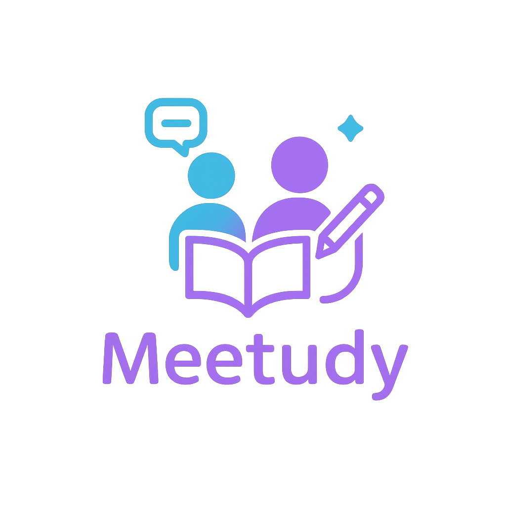

<h1 align="center">
  
  <br />
  <strong>Meetudy</strong> - 당신의 스터디를 더 스마트하게 💡
</h1>

> 🤝 **혼자보다는 함께할 때 더 큰 동기부여가 생깁니다.**  
> ✨ 구성원 간 실시간 피드백과 격려를 주고받으며,  
> 🚀 함께 성장해 보세요.

---

## 📝 프로젝트 개요

**Meetudy**는 스터디 그룹 관리, 실시간 채팅, 게시판, 알림 기능 등을 제공하는  
협업 중심의 **스터디 플랫폼**입니다.  
스터디 구성원은 함께 학습 내용을 공유하고 피드백을 주고받으며  
더 효율적으로 성장할 수 있습니다.

---

## 📚 목차

- [⚙️ 개발 환경](#️-개발-환경)
- [🚀 실행 방법](./Settings/setting/readme.md)
- [✨ 주요 기능](#-주요-기능)
- [🔐 로그인 및 인증](./Settings/auth/readme.md)
- [🏠 메인](./Settings/main/readme.md)
- [👥 스터디 그룹](./Settings/studygroup/list.md)
  - [📋 스터디 그룹 목록](./Settings/studygroup/list.md)
  - [📄 스터디 그룹 상세](./Settings/studygroup/detail.md)
  - [📝 스터디 그룹 등록](./Settings/studygroup/insert.md)
  - [🛠️ 스터디 그룹 수정](./Settings/studygroup/update.md)
- [📂 스터디 그룹 관리](./Settings/studygroupmanage/readme.md)
- [❓ 문의 사항](./Settings/qna/readme.md)
- [💬 자유 게시판](./Settings/board/readme.md)
- [👤 내 정보](./Settings/myinfo/readme.md)
- [🔔 알림](./Settings/notification/readme.md)

---

## ⚙️ 개발 환경

```
vs code settings.json

{
  "editor.formatOnSave": true,
  "editor.defaultFormatter": "esbenp.prettier-vscode",
  "workbench.iconTheme": "material-icon-theme",
  "editor.codeActionsOnSave": {
    "source.fixAll.eslint": "explicit"
  },
  "eslint.workingDirectories": [
    {
      "mode": "auto"
    }
  ],
  "files.eol": "\n",
  // Prettier 옵션 명시적으로 추가
  "prettier.singleQuote": false,
  "prettier.semi": true,
  "prettier.useTabs": false,
  "prettier.tabWidth": 2,
  "prettier.trailingComma": "all",
  "prettier.printWidth": 80,
  "prettier.bracketSpacing": true,
  "prettier.arrowParens": "always",
  "explorer.confirmDragAndDrop": false,
  "typescript.updateImportsOnFileMove.enabled": "always"
}

```

```
typeScript : Yes
ESLint : Yes
Tailwind Css :Yes
src/ direction : Yes
App Route : Yes
TurboPack : NO
```

<div class="markdown-heading" dir="auto">
 <h2 tabindex="-1" class="heading-element" dir="auto">도커 실행 방법</h2>
</div>

docker-compose -f compose.dev.yml up --build

<div class="markdown-heading" dir="auto">
    <h2 tabindex="-1" class="heading-element" dir="auto">VSCode 플러그인 목록</h2>
    <a id="user-content-vscode-플러그인-목록" class="anchor" aria-label="Permalink: VSCode 플러그인 목록" href="#vscode-플러그인-목록">
        <svg class="octicon octicon-link" viewBox="0 0 16 16" version="1.1" width="16" height="16" aria-hidden="true"></svg>
    </a>
</div>

<ul dir="auto">
<li>색 테마 : <a href="https://marketplace.visualstudio.com/items?itemName=sdras.night-owl" rel="nofollow">Night Owl</a></li>
<li>파일 아이콘 테마 : <a href="https://marketplace.visualstudio.com/items?itemName=PKief.material-icon-theme" rel="nofollow">Material Icon Theme</a></li>
<li>리액트 : <a href="https://marketplace.visualstudio.com/items?itemName=dsznajder.es7-react-js-snippets" rel="nofollow">ES7+ React/Redux/React-Native snippets</a>, <a href="https://marketplace.visualstudio.com/items?itemName=burkeholland.simple-react-snippets" rel="nofollow">Simple React Snippets</a></li>
<li>자바스크립트 : <a href="https://marketplace.visualstudio.com/items?itemName=xabikos.JavaScriptSnippets" rel="nofollow">JavaScript (ES6) code snippets</a></li>
<li>문법 검사 : <a href="https://marketplace.visualstudio.com/items?itemName=dbaeumer.vscode-eslint" rel="nofollow">ESLint</a>, <a href="https://marketplace.visualstudio.com/items?itemName=esbenp.prettier-vscode" rel="nofollow">Prettier</a>, <a href="https://marketplace.visualstudio.com/items?itemName=Tobermory.es6-string-html" rel="nofollow">ES6 String HTML</a></li>
<li>실습 환경 보조 : <a href="https://marketplace.visualstudio.com/items?itemName=ritwickdey.LiveServer" rel="nofollow">Live Server</a></li>
</ul>
```

라이브러리 다운 : npm install --legacy-peer-deps

---

## ✨ 주요 기능

- ✅ 스터디 그룹 생성 및 관리
- 💬 실시간 채팅 (WebSocket 기반)
- 🔔 사용자별 알림 시스템 (Redis Pub/Sub)
- 🧾 자유 게시판 / 문의 게시판
- 🔐 JWT 기반 로그인 & 소셜 로그인 (OAuth2)
