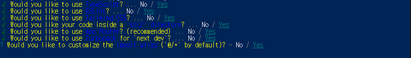

<div class="markdown-heading" dir="auto">
 <h2 tabindex="-1" class="heading-element" dir="auto">프로젝트 초기 설정</h2>
</div>
<p>npx create-next-app@latest meetudy-frontend</p>



라이브러리 다운 : npm install --legacy-peer-deps

```
vs code settings.json

{
  "editor.formatOnSave": true,
  "editor.defaultFormatter": "esbenp.prettier-vscode",
  "workbench.iconTheme": "material-icon-theme",
  "editor.codeActionsOnSave": {
    "source.fixAll.eslint": "explicit"
  },
  "eslint.workingDirectories": [
    {
      "mode": "auto"
    }
  ],
  "files.eol": "\n",
  // ✅ Prettier 옵션 명시적으로 추가
  "prettier.singleQuote": false,
  "prettier.semi": true,
  "prettier.useTabs": false,
  "prettier.tabWidth": 2,
  "prettier.trailingComma": "all",
  "prettier.printWidth": 80,
  "prettier.bracketSpacing": true,
  "prettier.arrowParens": "always",
  "explorer.confirmDragAndDrop": false,
  "typescript.updateImportsOnFileMove.enabled": "always"
}

```

```
typeScript : Yes
ESLint : Yes
Tailwind Css :Yes
src/ direction : Yes
App Route : Yes
TurboPack : NO
```

<div class="markdown-heading" dir="auto">
 <h2 tabindex="-1" class="heading-element" dir="auto">도커 실행 방법</h2>
</div>

docker-compose -f compose.dev.yml up --build

<div class="markdown-heading" dir="auto">
    <h2 tabindex="-1" class="heading-element" dir="auto">VSCode 플러그인 목록</h2>
    <a id="user-content-vscode-플러그인-목록" class="anchor" aria-label="Permalink: VSCode 플러그인 목록" href="#vscode-플러그인-목록">
        <svg class="octicon octicon-link" viewBox="0 0 16 16" version="1.1" width="16" height="16" aria-hidden="true"></svg>
    </a>
</div>

<ul dir="auto">
<li>색 테마 : <a href="https://marketplace.visualstudio.com/items?itemName=sdras.night-owl" rel="nofollow">Night Owl</a></li>
<li>파일 아이콘 테마 : <a href="https://marketplace.visualstudio.com/items?itemName=PKief.material-icon-theme" rel="nofollow">Material Icon Theme</a></li>
<li>리액트 : <a href="https://marketplace.visualstudio.com/items?itemName=dsznajder.es7-react-js-snippets" rel="nofollow">ES7+ React/Redux/React-Native snippets</a>, <a href="https://marketplace.visualstudio.com/items?itemName=burkeholland.simple-react-snippets" rel="nofollow">Simple React Snippets</a></li>
<li>자바스크립트 : <a href="https://marketplace.visualstudio.com/items?itemName=xabikos.JavaScriptSnippets" rel="nofollow">JavaScript (ES6) code snippets</a></li>
<li>문법 검사 : <a href="https://marketplace.visualstudio.com/items?itemName=dbaeumer.vscode-eslint" rel="nofollow">ESLint</a>, <a href="https://marketplace.visualstudio.com/items?itemName=esbenp.prettier-vscode" rel="nofollow">Prettier</a>, <a href="https://marketplace.visualstudio.com/items?itemName=Tobermory.es6-string-html" rel="nofollow">ES6 String HTML</a></li>
<li>실습 환경 보조 : <a href="https://marketplace.visualstudio.com/items?itemName=ritwickdey.LiveServer" rel="nofollow">Live Server</a></li>
</ul>
