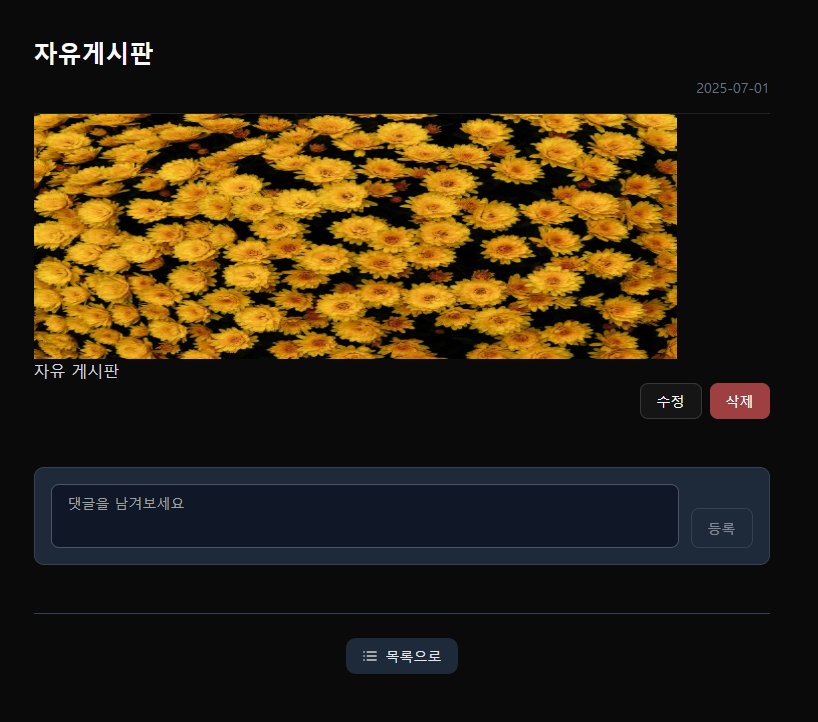

### 💬 자유 게시판 상세

[🔝 메인 목차로 이동](../../README.md)

## 

---

## 🧭 이 페이지에서 다루는 내용

- [🧭 이 페이지에서 다루는 내용](#-이-페이지에서-다루는-내용)
  - [💬 자유 게시판 상세](#-자유-게시판-상세)
- [💬 자유 게시판 목록](./list.md)
- [💬 자유 게시판 등록/수정](./write.md)

---

## 💬 자유 게시판 상세

### 📍 기능 요약

- 게시글 상세 조회
- 댓글 작성/수정/삭제
- 목록 이동
- 작성자 본인만 수정/삭제 가능

1️⃣ **게시글 상세** 정보를 조회합니다.

- 제목
- 내용
- 작성일
- 댓글 목록

2️⃣ **댓글 기능**을 제공 합니다.

- 댓글 내용 , 작성자 닉네임 표시
- 로그인한 사용자만 작성 가능
- 등록순 정렬
- 본인 댓글에 한해 [수정/삭제] 버튼 노출

3️⃣ **수정 버튼** 클릭 시, 게시글 수정 페이지로 이동합니다.

- 작성자 본인만 버튼 활성화

4️⃣ **삭제 버튼** 클릭 시, 게시글을 삭제합니다.

- 작성자 본인만 버튼 활성화

5️⃣ **목록 버튼** 클릭 시, 게시글 목록 페이지로 이동합니다.
