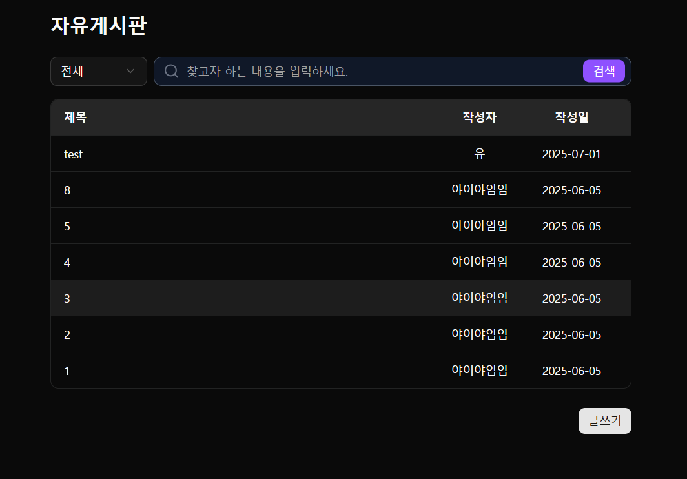

### 💬 자유 게시판

[🔝 메인 목차로 이동](../../README.md)

## 

---

## 🧭 이 페이지에서 다루는 내용

- [🧭 이 페이지에서 다루는 내용](#-이-페이지에서-다루는-내용)
  - [💬 자유 게시판 목록](#-자유-게시판-목록)
- [💬 자유 게시판 상세](./detail.md)
- [💬 자유 게시판 등록/수정](./write.md)

---

## 💬 자유 게시판 목록

### 📍 기능 요약

- 자유 게시판 목록 조회
- 검색 기능 (제목, 작성자)
- 게시글 상세 진입
- 게시글 작성 버튼

1️⃣ **자유 게시판 목록**을 조회합니다.

- 제목
- 작성자
- 작성일
- 페이징 처리: 10건씩

2️⃣ **검색 기능**을 제공합니다.

- 전체
- 제목
- 작성자

3️⃣ **게시글 목록 항목 클릭 시**, 상세 페이지로 이동합니다.

4️⃣ **글쓰기 버튼**을 클릭 시, 자유 게시판 작성 페이지로 이동합니다.

- 로그인한 사용자만 버튼 활성화
