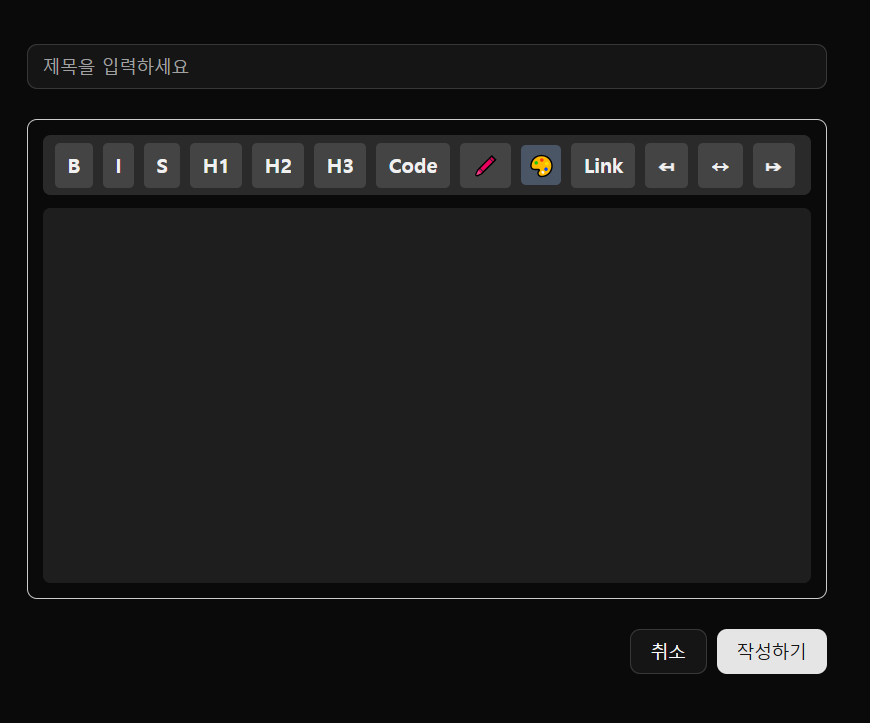

### 💬 자유 게시판 등록/수정

[🔝 메인 목차로 이동](../../README.md)

## 

---

## 🧭 이 페이지에서 다루는 내용

- [🧭 이 페이지에서 다루는 내용](#-이-페이지에서-다루는-내용)
  - [💬 자유 게시판 등록/수정](#-자유-게시판-등록수정)
- [💬 자유 게시판 목록](./list.md) 
- [💬 자유 게시판 상세](./detail.md)

---

## 💬 자유 게시판 등록/수정

### 📍 기능 요약

- 자유 게시판 글 등록
- 자유 게시판 글 수정

1️⃣ **등록 페이지**를 조회합니다.
- 제목 입력란
- Tiptap 에디터(내용 입력)

2️⃣ **작성하기 버튼** 클릭 시 유효성 검사 후 게시글을 저장합니다.
- 제목 필수
- 내용 필수

3️⃣ **취소 버튼** 클릭 시 게시글 목록 페이지로 이동합니다.

4️⃣ **수정 페이지**도 등록 페이지와 동일한 UI를 사용하며,
기존 글 정보를 불러와 수정 가능합니다.
