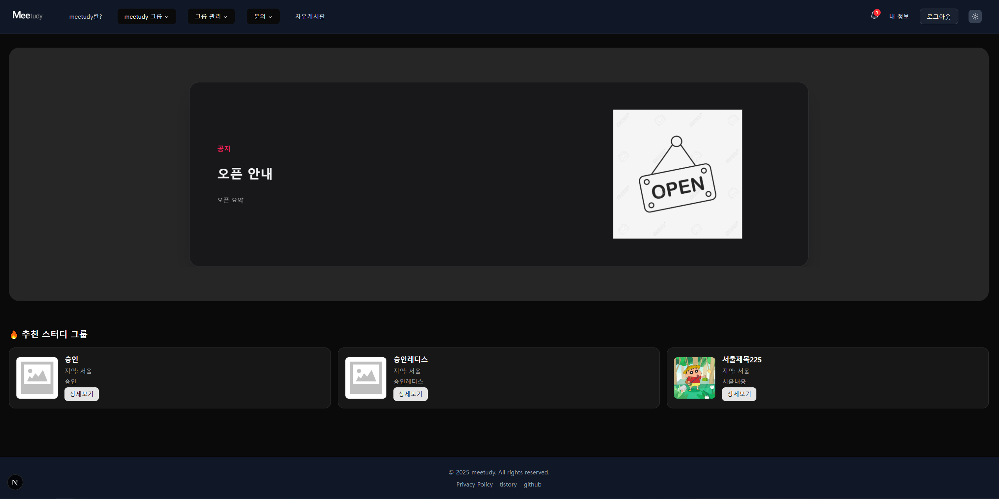

### 🏠 메인

[🔝 메인 목차로 이동](../../README.md)

## 메인 화면

---

## 🧭 이 페이지에서 다루는 내용

- [메인 화면](#메인-화면)
- [🧭 이 페이지에서 다루는 내용](#-이-페이지에서-다루는-내용)
  - [📢 공지 사항](#-공지-사항)
  - [📕 추천 스터디 그룹](#-추천-스터디-그룹)

---

### 📢 공지 사항

1️⃣ **메인 화면 진입 시**, 최근 공지사항 5개를 조회합니다.

2️⃣ **캐시 확인**

- Redis 캐시에서 공지사항 목록을 먼저 확인합니다.
- 캐시가 존재하면 해당 데이터를 사용합니다.
- 없을 경우를 대비해 Redis는 3시간 주기로 자동 갱신됩니다.

3️⃣ **분기 처리**

- ✅ 캐시에 데이터가 있는 경우 →
  1. 캐시 데이터 반환
- ❌ 캐시에 데이터가 없는 경우 →
  1. DB에서 공지사항 조회
  2. Redis에 저장
  3. 클라이언트에 응답

---

### 📕 추천 스터디 그룹

1️⃣ **메인 화면 진입 시**, 추천 스터디 그룹 3개를 조회합니다.

2️⃣ **조회 조건**

- 최대 인원에 도달하지 않은 그룹
- 모집이 완료되지 않은 그룹
- 비밀번호가 설정되지 않은 그룹

3️⃣ **캐시 확인**

- Redis 캐시에서 추천 그룹 목록을 먼저 확인합니다.
- 캐시가 존재하면 해당 데이터를 사용합니다.
- 없을 경우를 대비해 Redis는 3시간 주기로 자동 갱신됩니다.

4️⃣ **분기 처리**

- ✅ 캐시에 데이터가 있는 경우 →
  1. 캐시 데이터 반환
- ❌ 캐시에 데이터가 없는 경우 →
  1. DB에서 추천 그룹 조회
  2. Redis에 저장
  3. 클라이언트에 응답
