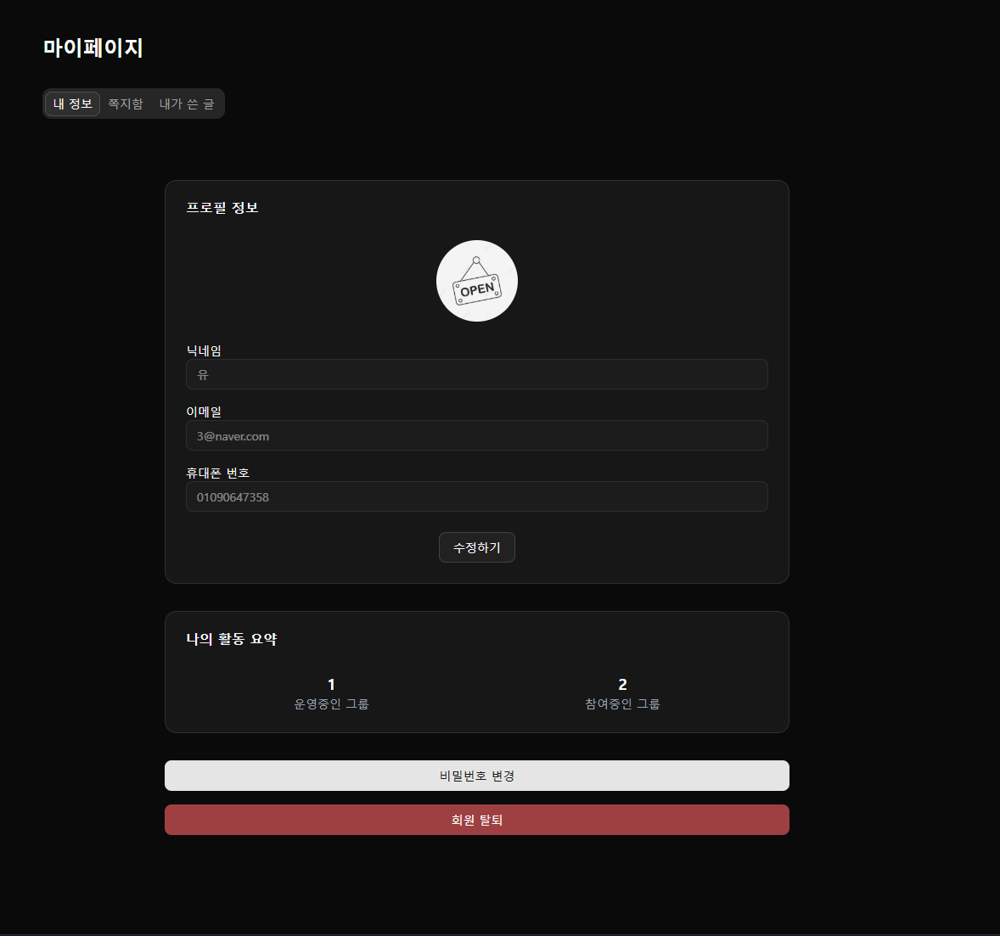

### 👤 내 정보

[🔝 메인 목차로 이동](../../README.md)

## 

---

## 🧭 이 페이지에서 다루는 내용

- [🧭 이 페이지에서 다루는 내용](#-이-페이지에서-다루는-내용)
  - [👤 내 정보 상세](#-내-정보-상세)
- [📬 쪽지함](./message.md)
- [📝 내가 쓴 글](./board.md)

---

## 👤 내 정보 상세

### 📍 기능 요약

- 내 프로필 정보 확인 및 수정
- 비밀번호 변경
- 회원 탈퇴

1️⃣ **상세 진입 시**, 사용자의 정보를 조회 합니다.

- 프로필 사진
- 닉네임
- 이메일
- 휴대폰 번호
- 운영중인 그룹
- 참여중인 그룹
- 비밀번호 변경 버튼
- 회원 탈퇴 버튼

2️⃣ **수정하기 버튼**을 클릭하여 정보를 수정 합니다.

- 프로필 사진
- 닉네임
- 이메일
- 휴대폰 번호

3️⃣ **비밀번호 변경 버튼 클릭**을 하여 비밀번호를 변경 합니다.

4️⃣ **회원 탈퇴 버튼 클릭**을 하여 회원을 탈퇴 합니다.

- 탈퇴 시 유의사항
  - 탈퇴 후 복구 불가
- 탈퇴시 그룹 모두 탈퇴
