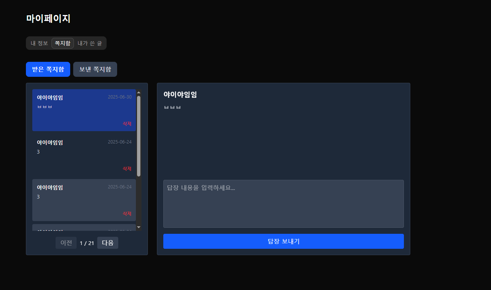

### 📬 쪽지함

[🔝 메인 목차로 이동](../../README.md)

## 

---

## 🧭 이 페이지에서 다루는 내용

- [🧭 이 페이지에서 다루는 내용](#-이-페이지에서-다루는-내용)
  - [📬 쪽지함](#-쪽지함)
- [👤 내 정보 상세](./list.md)
- [📝 내가 쓴 글](./board.md)

---

## 📬 쪽지함

### 📍 기능 요약

- 받은 쪽지함
- 보낸 쪽지함
- 쪽지 전송

### 📥 받은 쪽지함

- 쪽지 목록 조회 (5건 단위, 다음/이전 버튼 제공)
  - 전송 일시
  - 보낸 사람 닉네임
  - 쪽지 내용 표시
- 목록 항목 클릭 시 쪽지 상세 조회
  - 내용 확인 및 **읽음 처리** (목록에서 색상 변경으로 구분)
  - 쪽지 회신 가능 (쪽지 전송 시 수신자에게 알림 발송)
  - 삭제 가능

---

### 📤 보낸 쪽지함

- 보낸 쪽지 목록 조회 (5건 단위, 다음/이전 버튼 제공)
  - 전송 일시
  - 수신자 닉네임
  - 쪽지 내용 표시
- 목록 항목 클릭 시 쪽지 상세 조회
  - 내용 확인
  - 삭제 가능

---

### ✉️ 쪽지 전송

- 채팅방 목록, 쪽지 상세 화면에서 전송 가능
- 쪽지 전송 시 수신자에게 실시간 알림 발송
