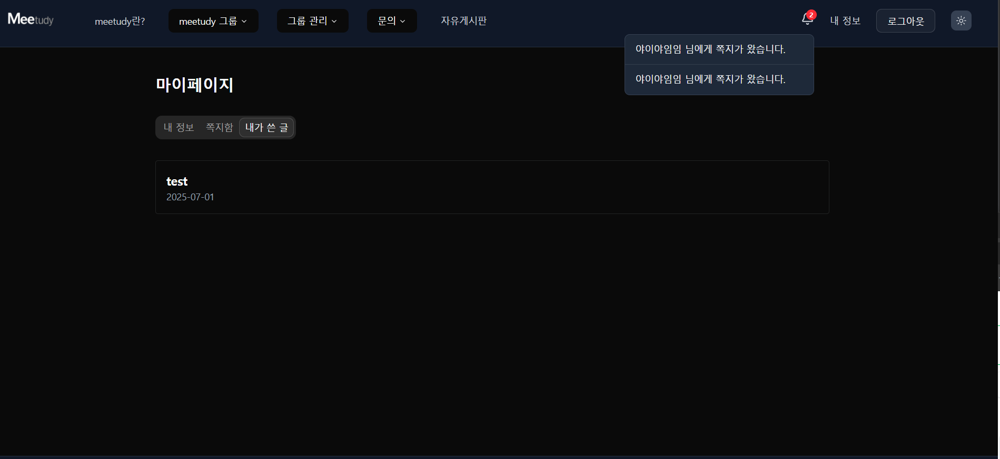

### 🔔 알림

[🔝 메인 목차로 이동](../../README.md)

## 

---

## 🧭 이 페이지에서 다루는 내용

- [🧭 이 페이지에서 다루는 내용](#-이-페이지에서-다루는-내용)
    - [🔔 알림](#알림)

---

## 🔔 알림

### 📍 기능 요약

- 알림 리스트 조회
- 알림 상세 확인 및 링크 이동
- 실시간 알림 수신

---

### 📥 알림 목록

1️⃣ 알림 목록을 실시간으로 수신 및 조회합니다.
- 최신순으로 정렬되어 표시됩니다.
- 최대 30일 까지 보관 됩니다.

2️⃣ 각 알림 항목을 클릭하면 관련된 **페이지로 이동**합니다.
- 예: 쪽지 → 쪽지함 상세, 그룹 알림 → 해당 그룹 상세 등

3️⃣ **알림 목록 클릭**시 알림 읽음 처리로 목록에서 사라집니다.

---

### ⚙️ 알림 발생 조건

다음과 같은 이벤트 발생 시 실시간 알림이 생성됩니다:

- ✅ 그룹 **방장**에게 구성원이 가입했을 때
- ✅ 그룹 **방장**에게 구성원이 탈퇴했을 때
- ✅ 그룹 **방장**에게 구성원이 승인 요청 시
- ✅ 그룹 **방장**에게 구성원이 승인 요청 취소 시
- ✅ 사용자가 쪽지를 수신했을 때
- ✅ 사용자의 그룹 생성 **승인 완료** 시
- ✅ 사용자의 그룹 생성 **승인 거절** 시

---

### 📌 추후 고려 사항 

- 알림 삭제 기능 여부
- 알림 On/Off 기능 추가 여부 