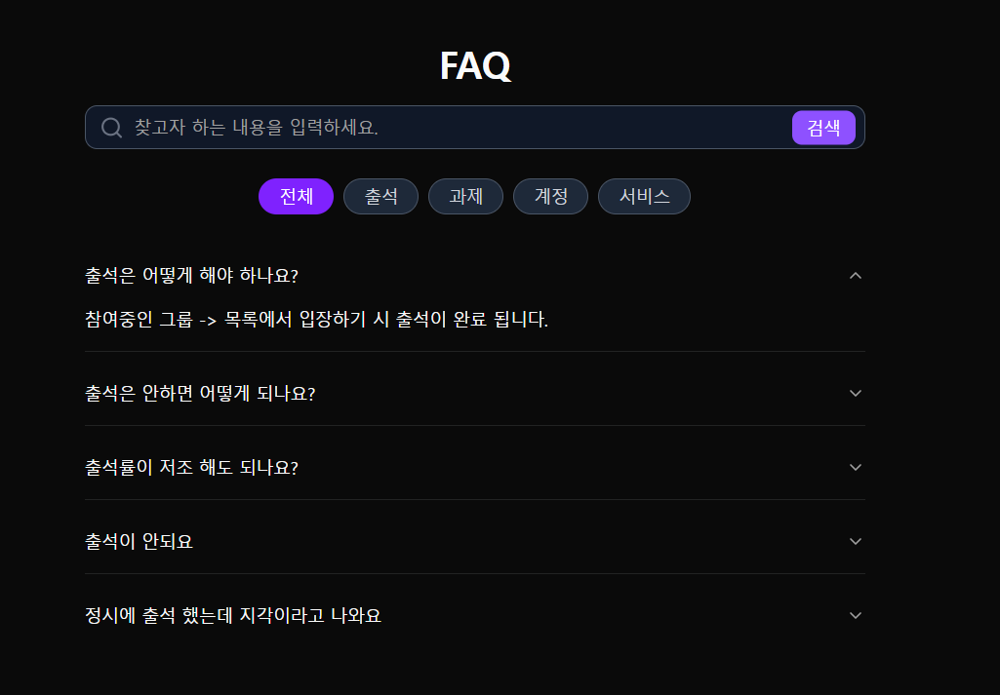

### ❓ FAQ

[🔝 메인 목차로 이동](../../README.md)

## 

## 🧭 이 페이지에서 다루는 내용

- [🧭 이 페이지에서 다루는 내용](#-이-페이지에서-다루는-내용)
  - [❓ FAQ](./faq.md)
- [📢 공지 사항](./notice.md)
- [📞QNA](./qna.md)

---

### ❓ FAQ

1️⃣ **목록 진입 시**, FAQ 목록 정보를 조회 합니다.

- 질문
- 답변
- 페이징 [10건]
- 페이징 10건 초과 시 버튼 활성화

2️⃣ **검색 조건**을 이용해 FAQ 목록을 조회합니다.

- 질문
- 타입 (예: 출석,과제,계정,서비스)

3️⃣ 원하는 답변이 없을 경우, **문의 등록(QNA)** 버튼이 노출됩니다.

- 질문 클릭 시 답변이 펼쳐지는 UI 제공
