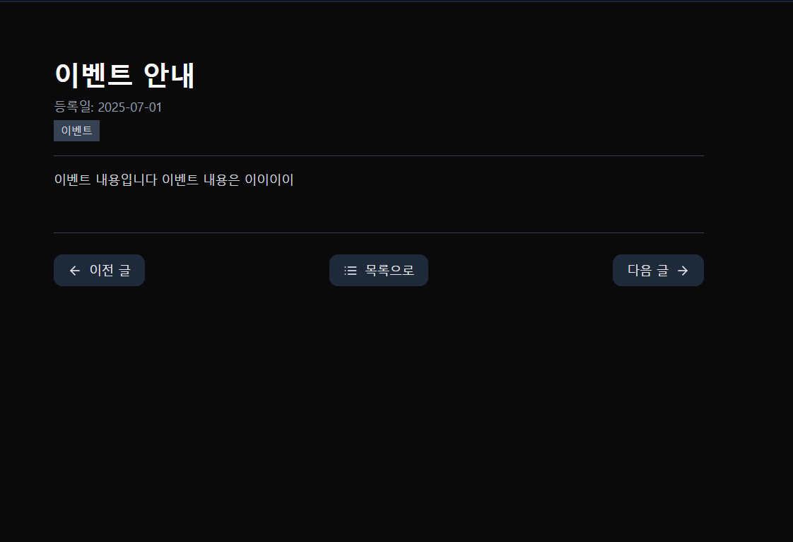

### ❓ 문의 사항 [공지 사항]

[🔝 메인 목차로 이동](../../README.md)

## 
## 

---

## 🧭 이 페이지에서 다루는 내용

- [🧭 이 페이지에서 다루는 내용](#-이-페이지에서-다루는-내용)
    - [📢 공지 사항 목록](#-공지사항-목록)
    - [📢 공지 사항 상세](#-공지사항-상세)
- [❓ FAQ](./faq.md)
- [📞QNA](./qna.md)

---

## 📢 공지 사항

### 📢 공지사항 목록

1️⃣ **목록 진입 시**, 공지 사항 목록 정보를 조회 합니다.
- 제목
- 작성일
- 공지 사항 타입
- 페이징 10건 조회
- 10건 초과 페이징 버튼 활성화

2️⃣ **목록 버튼 클릭**시, 공지 사항 상세 페이지로 이동 합니다.

### 📢 공지사항 상세
1️⃣ **상세 진입 시**, 공지 사항 상세 정보를 조회 합니다.
- 제목
- 작성일
- 공지 사항 타입
- 내용
- 목록 버튼
- 이전 글 / 다음 글 버튼

2️⃣ **이전 글 / 다음 글** 존재 할 경우 버튼이 활성화 되며 버튼을 클릭하여 이동 가능 합니다.

3️⃣ **목록 버튼** 클릭 시 목록 페이지로 이동 합니다.

#### 📌 기타 기능

- 관리자 전용 등록/수정/삭제 기능
