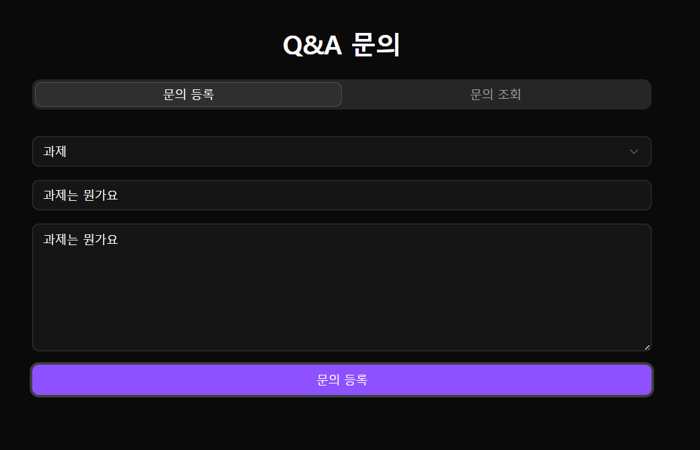
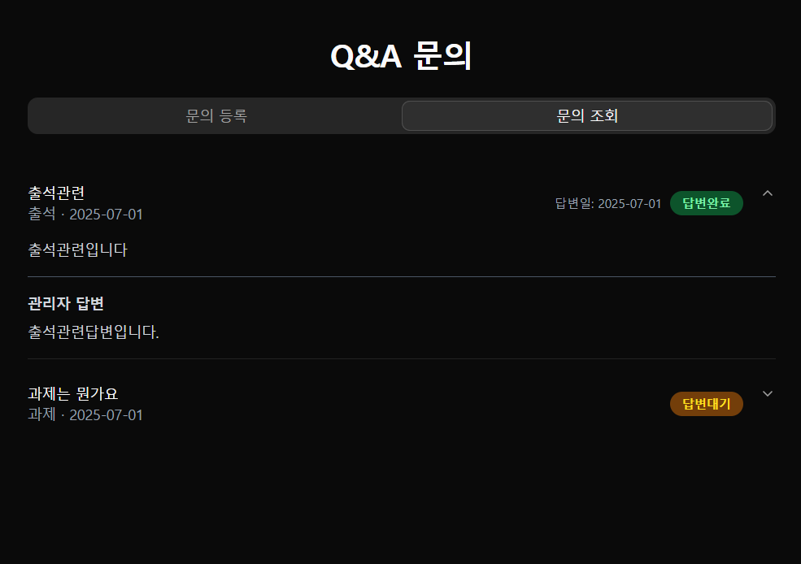

### 📞 QNA

[🔝 메인 목차로 이동](../../README.md)

## 

## 

## 🧭 이 페이지에서 다루는 내용

- [🧭 이 페이지에서 다루는 내용](#-이-페이지에서-다루는-내용)
  - [📞QNA](#-qna)
- [📢 공지 사항](./notice.md)
- [❓ FAQ](./faq.md)

---

### 📞 QNA

1️⃣ **QNA 진입 시**, QNA 입력 화면이 조회 됩니다.

- QNA 타입
- 제목
- 내용
- 로그인 유저만 사용 가능

2️⃣ **문의 등록 버튼**클릭 시 필수 유효성 검사 후 문의 등록 저장을 합니다.

- QNA 타입
- 제목
- 내용

3️⃣ **문의 조회 진입 시** , QNA 문의 목록이 조회 됩니다.

- 제목
- QNA 타입
- 질문 내용
- 답변 내용
- 답변일
- 답변 상태 (답변대기 / 답변완료)

4️⃣ **질문 클릭 시**, 답변이 펼쳐지는 UI가 제공됩니다.

### 추가 요청 기능

- 답변 전까지 수정/삭제 기능 추가 하기
