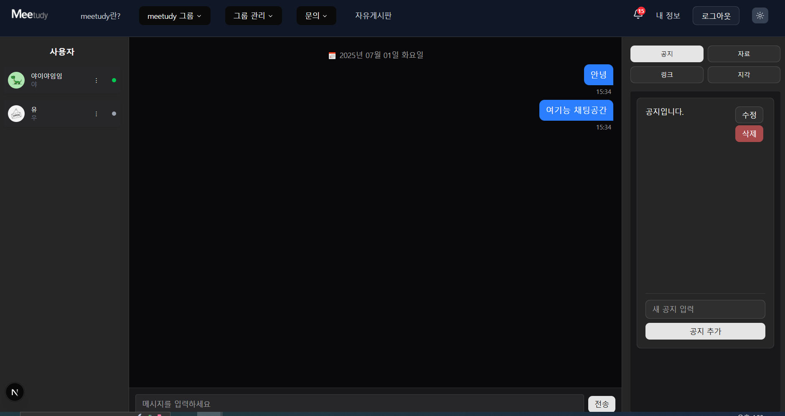

### 📂 스터디 그룹 관리 - 채팅

[🔝 메인 목차로 이동](../../README.md)

## 

## 🧭 이 페이지에서 다루는 내용

- [🧭 이 페이지에서 다루는 내용](#-이-페이지에서-다루는-내용)
  - [💬 그룹 채팅](#-그룹-채팅)
- [🚋 운영 중인 그룹](./operate.md)
- [👀 참여 중인 그룹](./join.md)

---

### 💬 그룹 채팅

1️⃣ 채팅 화면 진입 시, 다음 탭이 노출됩니다:

- 채팅
- 공지
- 자료
- 링크
- 사용자 목록

2️⃣ 사용자 상태 표시

- 🟢 초록색: 온라인
- ⚪ 회색: 오프라인

3️⃣ **실시간 채팅**을 통해 구성원들과 메시지를 주고받을 수 있습니다.

4️⃣ **방장일 경우**, 공지를 등록할 수 있으며, 등록된 공지는 실시간으로 전달됩니다.

- 공지 수정 및 삭제 가능

5️⃣ **자료 등록 시**, 실시간으로 모든 사용자에게 전달됩니다.

- 등록자만 삭제 가능

6️⃣ **링크 등록 시**, 실시간으로 모든 사용자에게 전달됩니다.

- 등록자만 삭제 가능
