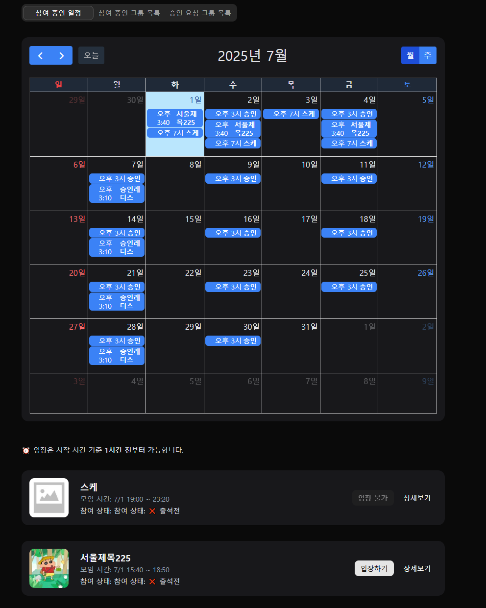
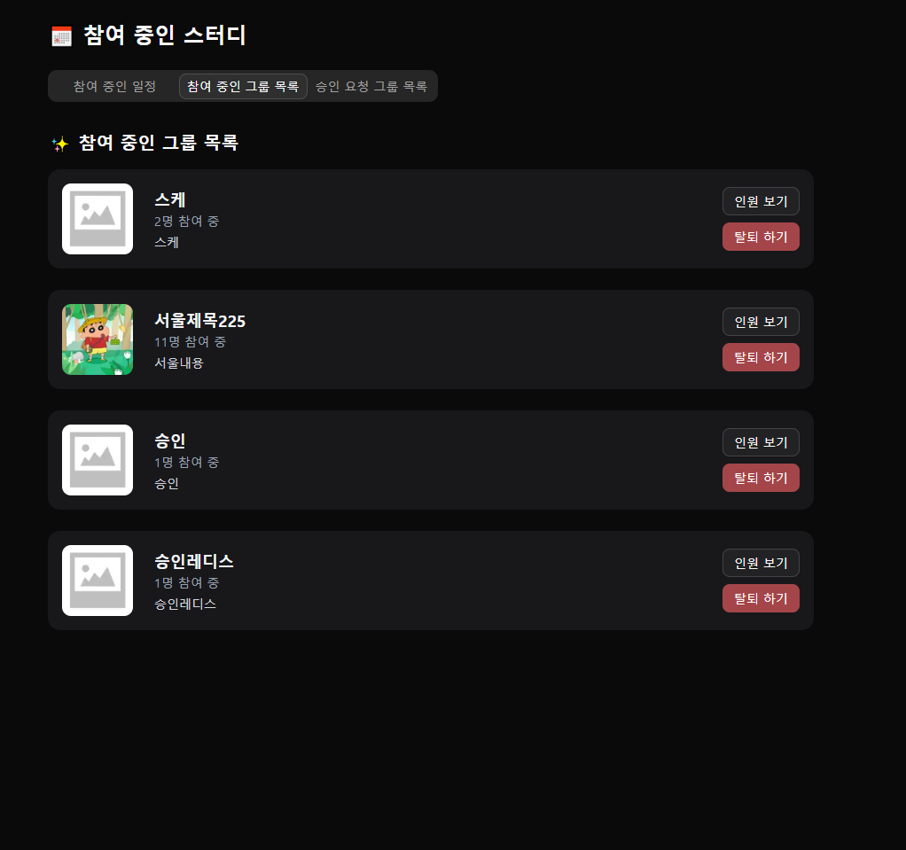
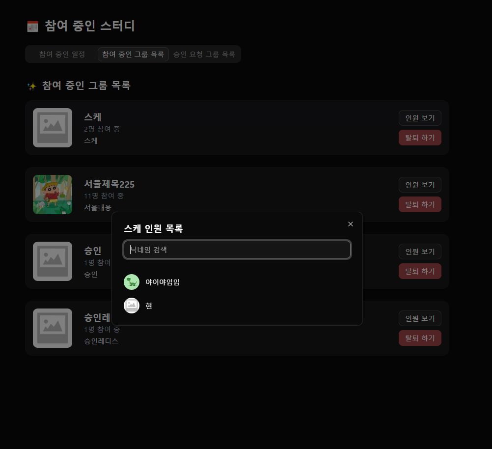
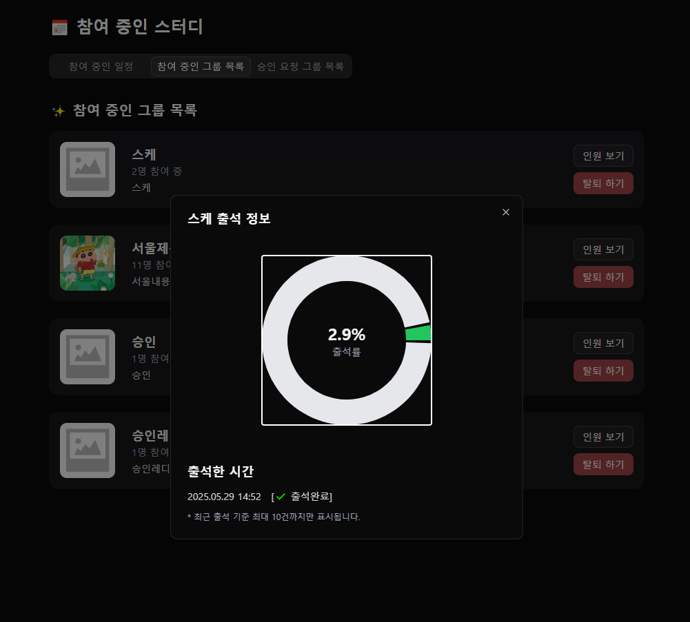

### 📂 스터디 그룹 관리 - 참여 중인 그룹

[🔝 메인 목차로 이동](../../README.md)

## 

## 

## 

## 

## 🧭 이 페이지에서 다루는 내용

- [🧭 이 페이지에서 다루는 내용](#-이-페이지에서-다루는-내용)
  - [👀 참여 중인 그룹](#-참여-중인-그룹)
  - [👀 참여 중인 일정](#-참여-중인-일정)
- [🚋 운영 중인 그룹](./operate.md)
- [💬 그룹 채팅](./chat.md)

---

### 👀 참여 중인 그룹

## 👀 참여 중인 일정

1️⃣ 해당 월의 **캘린더**에 참여 중인 그룹 스케줄 목록을 표시합니다.

2️⃣ 특정 **일자 클릭 시**, 해당 일자의 그룹 스케줄 목록을 하단에 표시합니다.

3️⃣ <, > 버튼 클릭 시, **이전 달/다음 달**의 그룹 스케줄 목록을 조회합니다.

4️⃣ **상세보기 버튼** 클릭 시, 해당 그룹의 상세 페이지로 이동합니다.

5️⃣ 입장 가능 조건:

- **모임 시작 1시간 전부터** 입장 버튼 활성화
- 그 전에는 "입장 불가"로 표시됨
- 입장 시 자동으로 **출석 체크** 처리

## 👀 참여 중인 그룹 목록

1️⃣현재 참여 중인 그룹들의 목록을 조회합니다.

2️⃣ 목록 항목 클릭 시, 해당 그룹에서 사용자의 **출석률을 조회**합니다.

3️⃣ **인원 보기** 버튼 클릭 시, 해당 그룹에 참여 중인 **전체 사용자 목록을 조회**합니다.

4️⃣ **탈퇴하기** 버튼 클릭 시, 해당 그룹에서 **탈퇴 처리**됩니다.

## 👀 승인 요청 그룹 목록

1️⃣가입 요청 중인 그룹들의 목록을 조회합니다.

2️⃣ **요청 취소 버튼** 클릭 시, 해당 그룹에 대한 **가입 요청이 취소**됩니다.
