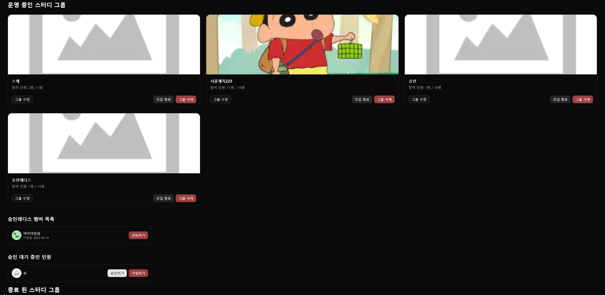

### 📂 스터디 그룹 관리 - 운영 중인 그룹

[🔝 메인 목차로 이동](../../README.md)

## 

## 

## 🧭 이 페이지에서 다루는 내용

- [🧭 이 페이지에서 다루는 내용](#-이-페이지에서-다루는-내용)
  - [🚋 운영 중인 그룹](#-qna)
- [👀 참여 중인 그룹](./join.md)
- [💬 그룹 채팅](./chat.md)

---

### 🚋 운영 중인 그룹

1️⃣ 진입 시, 방장인 사용자가 운영 중인/종료된 스터디 그룹 목록을 조회합니다.

- 썸네일
- 그룹명
- 참여 인원 수
- 그룹 수정 버튼
- 모집 종료 버튼
- 그룹 삭제 버튼

2️⃣ **그룹 수정 버튼** 클릭 시, 그룹 수정 페이지로 이동합니다.

3️⃣ **모집 종료 버튼** 클릭 시, 모집 상태를 종료합니다.

- 종료 시 더 이상 새로운 사용자가 가입할 수 없습니다.

4️⃣ **그룹 삭제 버튼** 클릭 시, 그룹을 삭제합니다.

5️⃣ **그룹 목록 항목 클릭 시**, 해당 그룹의 사용자 목록을 조회합니다.

- 가입된 사용자
- 승인 대기 중인 사용자

6️⃣ **강퇴 버튼** 클릭 시, 사용자를 그룹에서 강퇴할 수 있습니다.

- 본인은 강퇴할 수 없습니다.

7️⃣ **사용자 클릭 시**, 해당 사용자의 출석률을 조회합니다.

- 출석률 정보
- 최대 10건의 출석일 내역

8️⃣ **승인 대기 중인 사용자**에 대해 다음 작업이 가능합니다.

- 승인하기 : 그룹 가입 승인 [알림 발송]
- 거절하기 : 그룹 가입 거절 (미가입 처리) [알림 발송]
